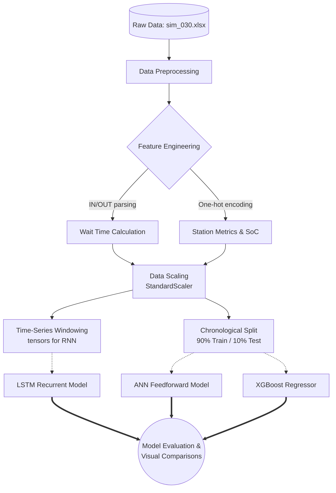

# 🔋 EV Battery Swap Station Simulation & Predictive Modeling


## 📌 Overview

The **Swap-Station-Simulation** project is a data analysis and machine learning pipeline designed to forecast wait times for electric vehicles at battery swap stations. By analyzing simulated operational data—such as station queues, remaining battery stock, and individual charging slot state-of-charge (SoC)—this project employs powerful predictive models to help optimize station throughput and user experience.

---

## 🚀 Features

- **Automated Wait-Time Calculation:** Dynamically parses raw vehicle IN (`I`) and OUT (`O`) events to establish target wait times.
- **Statistical Significance Testing:** Validates the impact of features like peak hours, queues, and battery SoC using independent and paired T-Tests.
- **Time-Series Processing:** Uses sliding window functions to format data as sequential tensors suitable for Recurrent Neural Networks.
- **Multi-Model Forecasting:** Benchmarks Artificial Neural Networks (ANN), Long Short-Term Memory (LSTM) networks, and XGBoost models against each other.
- **Rich Visualizations:** Generates bar charts comparing ground-truth testing data against predictions for rapid performance evaluation.

---

## 🏗️ Architecture Pipeline

The pipeline extracts data, processes it into workable time-series formats, and feeds it into three distinct ML models.



---

## 📁 Repository Structure

```text
Swap-Station-Simulation/
│
├── Analysis.py          # Main execution script: Data processing, training, and evaluation
├── functions.py         # Helper methods: Error metrics, time-window generation, wait intervals
├── models.py            # Neural network and XGBoost model architectures & training loops
│
├── sim_030.xlsx         # Primary simulation dataset (others include SIM.xlsx, sim_30.xlsx)
├── description.xlsx     # Generated descriptive statistics output
│
├── ann_model.h5         # Saved Keras ANN model (auto-generated)
├── lstm_model.h5        # Saved Keras LSTM model (auto-generated)
└── xgboost_model.pickle # Saved XGBoost model (auto-generated)
```

---

## 🧠 Machine Learning Models

1. **Artificial Neural Network (ANN):** A dense, fully connected network acting as our baseline deep learning model.
2. **Long Short-Term Memory (LSTM):** A recurrent model designed specifically to retain temporal context, making it highly adept at predicting traffic flows over time.
3. **XGBoost:** A gradient-boosted decision tree algorithm highly efficient at tabular regression tasks.

### 📊 Evaluation Metrics
Model performance is judged using the following metrics, dynamically printed via the `model_errors` function:
- Mean Squared Error (MSE) & Root Mean Squared Error (RMSE)
- Mean Absolute Error (MAE)
- R-squared ($R^2$) Score
- Mean Absolute Percentage Error (MAPE)

---

## 🛠️ Getting Started

### Prerequisites
Ensure you have Python 3.8+ installed along with the required libraries.

```bash
pip install pandas numpy scikit-learn tensorflow keras xgboost matplotlib openpyxl
```

### Running the Project
Simply execute the main analysis script. It will load the dataset, run statistical tests, train/load the predictive models, and display the comparative charts.

```bash
python Analysis.py
```

*Note: The script is configured to use a single CPU thread (`TF_NUM_THREADS = '1'`) and static seeds to ensure completely reproducible ML results across runs.*

---
*Created for optimization of EV infrastructure and Battery Swapping workflows.*
